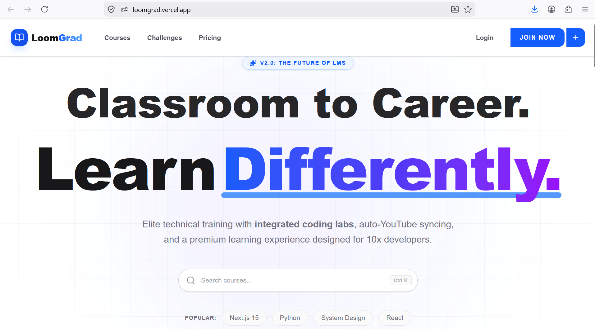
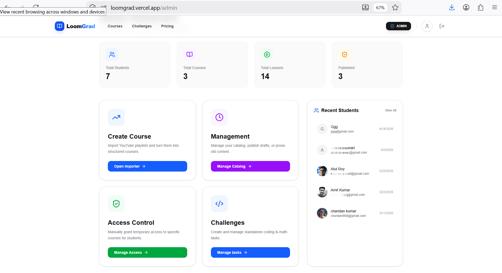
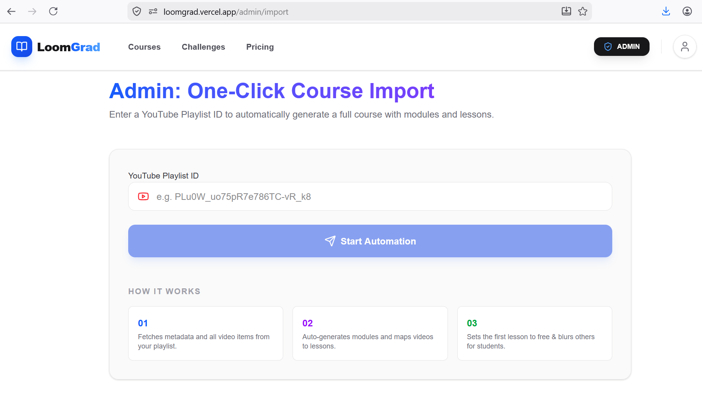
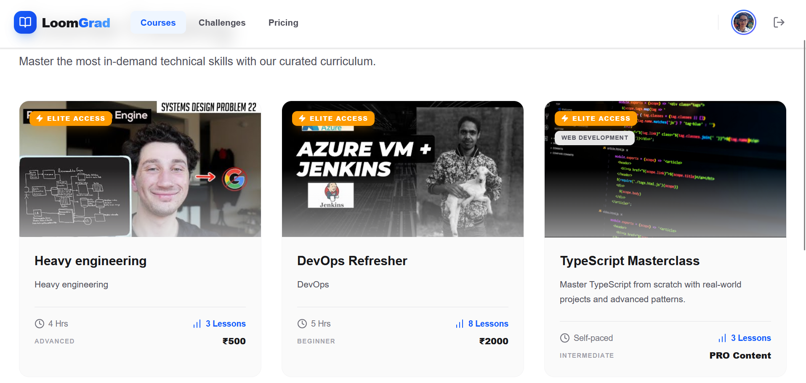
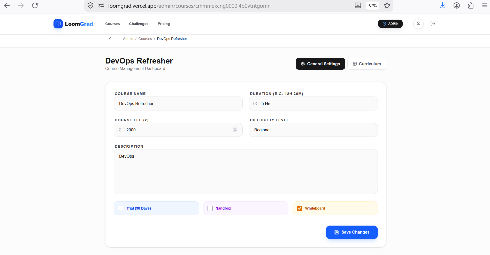
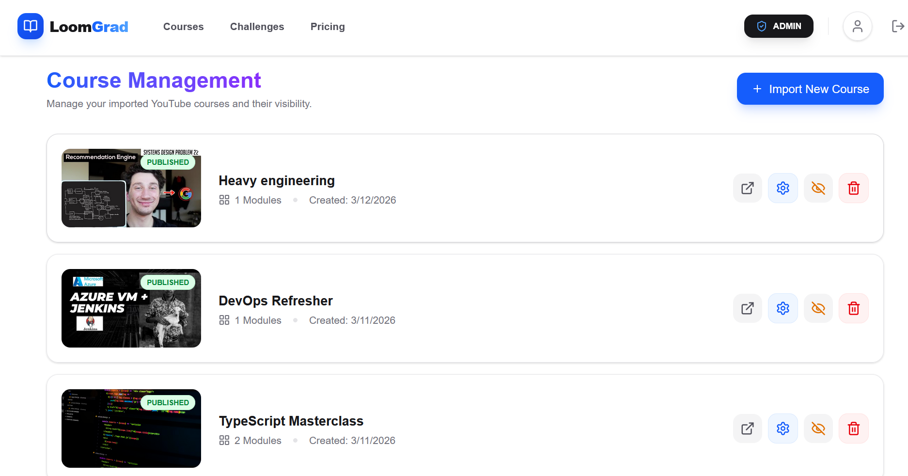
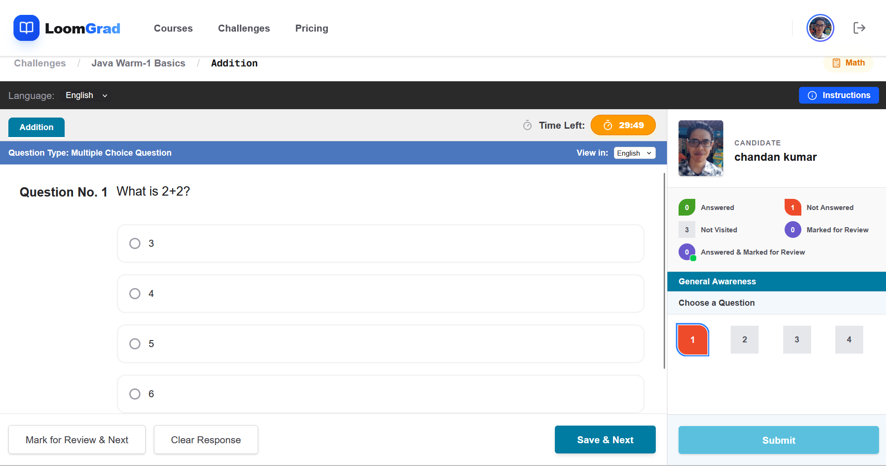
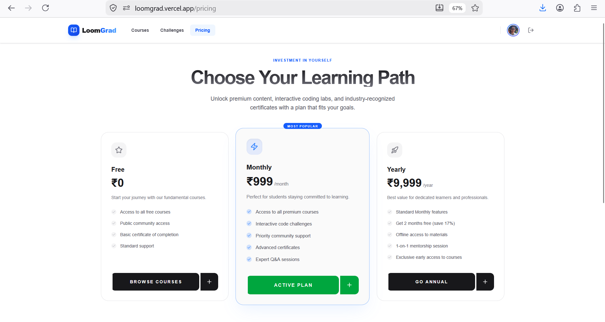

# LoomGrad

**Convert YouTube Playlists into Professional Learning Courses**

🌐 Live Demo: https://loomgrad.vercel.app/

📷 **Screenshots:** [Landing](#-landing-page) | [Admin Dashboard](#-admin-dashboard) | [Playlist to Course](#-youtube-playlist-to-course) | [Course Interface](#-course-learning-interface) | [Details](#-course-details) | [Settings](#-course-settings) | [Challenge](#-ibps-challenge-assessment) | [Payments](#-course-enrolment--payments)



## Problem

Millions of learners consume educational content through YouTube playlists, but playlists lack:

* Structured learning paths
* Progress tracking
* Assessments and quizzes
* Access control
* Monetization capabilities

LoomGrad transforms YouTube playlists into complete learning experiences with course management, assessments, authentication, and payment integration.

---

## Key Features

### 🎥 YouTube Playlist to Course

* Import YouTube playlists
* Automatically generate course lessons
* Organize videos into structured learning modules
* Manage course metadata and content

### 🔐 Authentication

* Google OAuth Login
* Secure user authentication
* Session management
* Protected routes

### 👥 Role-Based Access Control

#### User

* Browse available courses
* Purchase premium courses
* Access enrolled courses
* Attempt quizzes and challenges
* Track learning progress

#### Admin

* Create and manage courses
* Configure lessons and curriculum
* Manage challenge sections
* Create and publish quizzes
* Control course visibility and pricing

### 📝 Challenge Section

A dedicated assessment system inspired by competitive exam formats.

Features:

* IBPS-style multiple-choice questions
* Configurable challenge modules
* Time-based assessments
* Multiple difficulty levels
* Performance evaluation
* Admin-controlled question banks

### 💳 Razorpay Integration

* Secure payment processing
* Course purchase workflow
* Payment verification
* Automatic enrollment after successful payment

### 📊 Admin Dashboard

* Course management
* Quiz management
* User management
* Enrollment monitoring
* Revenue tracking

---

## Screenshots

### 💻 Landing Page


### 📊 Admin Dashboard


### 🔄 YouTube Playlist to Course


### 📖 Course Learning Interface


### 🔍 Course Details


### ⚙️ Course Settings


### 📝 IBPS Challenge Assessment


### 💳 Course Enrolment & Payments


---

## Tech Stack

### Frontend

* Next.js
* React
* TypeScript
* Tailwind CSS

### Backend

* Next.js Server Actions
* REST APIs

### Database

* Neon PostgreSQL

### ORM

* Prisma ORM

### Authentication

* Google OAuth

### Payments

* Razorpay

### Deployment

* Vercel

---

## Architecture

```text
User
 │
 ▼
Next.js Frontend
 │
 ├── Google OAuth
 │
 ├── Course Management
 │
 ├── Challenge Engine
 │
 └── Razorpay Checkout
 │
 ▼
Server Actions / APIs
 │
 ▼
Prisma ORM
 │
 ▼
Neon PostgreSQL
```

---

## Core Modules

### Course Module

* Create courses from YouTube playlists
* Manage lessons
* Publish/unpublish courses
* Track enrollments

### Challenge Module

* Create quizzes
* Add MCQ questions
* Configure IBPS-style assessments
* Set scoring criteria

### Payment Module

* Razorpay checkout
* Payment verification
* Enrollment automation

### User Module

* Google Sign-In
* Profile management
* Learning progress
* Course access control

---

## Environment Variables

```env
DATABASE_URL=

GOOGLE_CLIENT_ID=
GOOGLE_CLIENT_SECRET=

RAZORPAY_KEY_ID=
RAZORPAY_KEY_SECRET=

NEXTAUTH_SECRET=
NEXTAUTH_URL=

YOUTUBE_KEY=

```

---

## Future Roadmap

* AI-generated quiz creation from videos
* AI-generated course summaries
* Certificates of completion
* Leaderboards
* Subscription plans
* Learning analytics
* Multi-admin support
* Instructor portal

---

## Why LoomGrad?

LoomGrad bridges the gap between free educational content and structured online learning platforms by turning ordinary YouTube playlists into monetizable, assessment-driven courses with authentication, role management, and payment support.

---

## Author

**Chandan**

Built with ❤️ using Next.js, Prisma, Neon PostgreSQL, Razorpay, Youtube, and Google OAuth.

